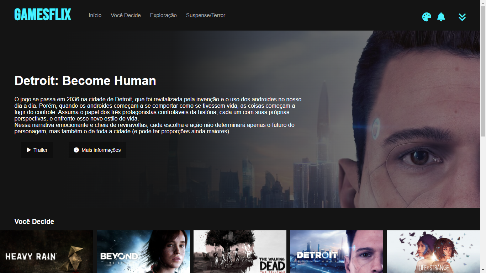

# GAMESFLIX - Desafio Recriando a interface da Netflix

Esse projeto foi desenvolvido para o desafio de Recriar a Interface da Netflix.  

Para isso, decidi criar o GAMESFLIX, uma plataforma em que encontramos jogos focados na narrativa e que se assemelham a filmes, porém interativos. 

Além de HTML e CSS, também utilizei Javascript para implementar funções de alerta e de mudança de cores. E para adicionar o carrousel com jQuery.

## Interface

## Responsividade
